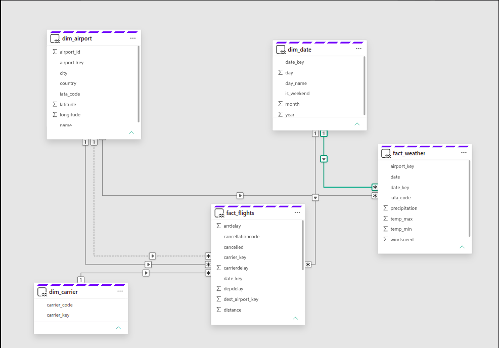

# ✈️ Flight Delay Analytics with Microsoft Fabric

An end-to-end data engineering and analytics project built with
Microsoft Fabric to analyze flight delays, cancellations, airline
performance, airport operations, and weather conditions.

## Project Overview

This project implements a complete analytics workflow using
Microsoft Fabric, starting from external flight data and ending
with an interactive Power BI report.

The project demonstrates:

- Data ingestion
- OneLake storage
- PySpark data transformation
- Data modeling
- Star schema design
- External API integration
- Data pipelines
- Pipeline scheduling and monitoring
- Power BI analytics

## Data Model

The analytical model follows a dimensional modeling approach.

### Dimensions

- `dim_date`
- `dim_airport`
- `dim_carrier`

### Fact

- `fact_flights`

### Supporting/Silver Layer

- `silver_flights`

The fact table contains flight-level measures and foreign keys
to the relevant dimensions.

## Weather Integration

Historical weather data was integrated using the Open-Meteo
Historical Weather API.

Airport coordinates were used to retrieve weather observations
for the relevant airport and time period.

Weather attributes included variables such as:

- Temperature
- Precipitation
- Cloud cover
- Wind speed
- Weather condition/code
