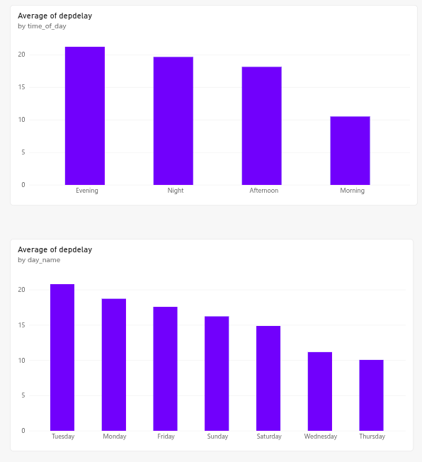
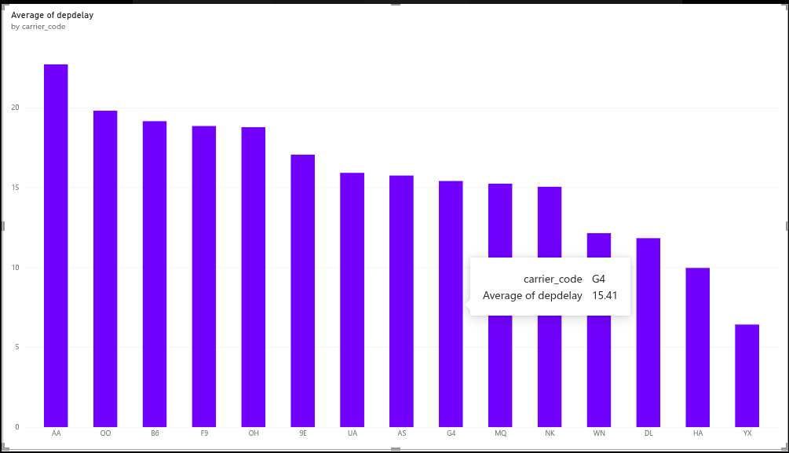
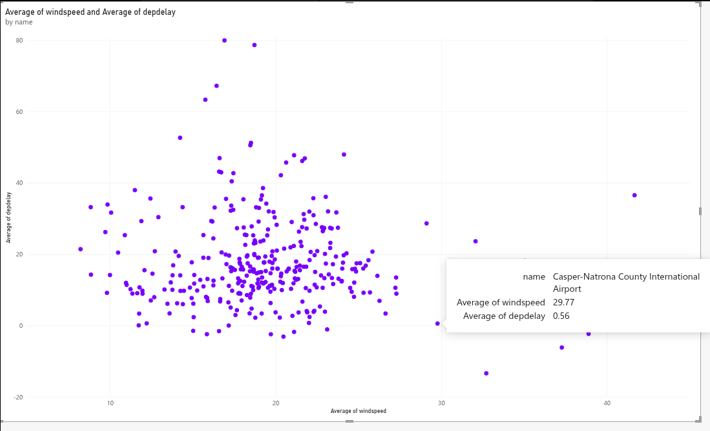
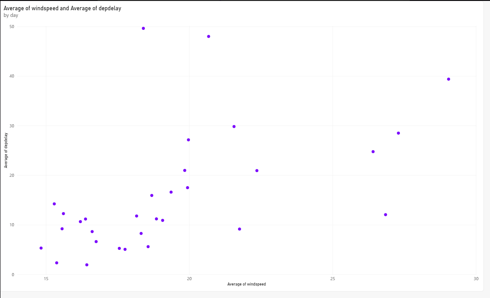

# ✈️ Flight Delay Analytics with Microsoft Fabric

An end-to-end data engineering and analytics project built with
Microsoft Fabric to analyze flight delays, cancellations, airline
performance, airport operations, and weather conditions.

## Project Overview

This project implements a complete analytics workflow using
Microsoft Fabric, starting from external flight data and ending
with an interactive Power BI report.

The project demonstrates:

- Data ingestion
- OneLake storage
- PySpark data transformation
- Data modeling
- Star schema design
- External API integration
- Data pipelines
- Pipeline scheduling and monitoring
- Power BI analytics

## Data Model

The analytical model follows a dimensional modeling approach.

### Dimensions

- `dim_date`
- `dim_airport`
- `dim_carrier`

### Fact

- `fact_flights`

### Supporting/Silver Layer

- `silver_flights`

The fact table contains flight-level measures and foreign keys
to the relevant dimensions.

## Weather Integration

Historical weather data was integrated using the Open-Meteo
Historical Weather API.

Airport coordinates were used to retrieve weather observations
for the relevant airport and time period.

Weather attributes included variables such as:

- Temperature
- Precipitation
- Cloud cover
- Wind speed
- Weather condition/code

The weather data was integrated to investigate the relationship
between weather conditions and flight delays.

## Power BI Dashboard

The final reporting layer combines operational, temporal, and weather
signals into a Power BI dashboard for exploratory analysis and
executive reporting.

### Dashboard Screenshots

### Key Insights

- Delay patterns change significantly across time, suggesting strong
  seasonality and day-level operational effects.
- Average delay time varies meaningfully by airline, highlighting
  differences in operational performance and disruption handling.
- Weather conditions appear to correlate with increased delays,
  reinforcing the value of combining operational and environmental
  data in the analysis.
- The dashboard helps identify where delays are concentrated, making it
  easier to prioritize mitigation actions for the most impacted routes,
  airports, and carriers.

This reporting layer demonstrates how the Fabric pipeline, data model,
and external weather enrichment work together to generate actionable
business insights from raw flight data.
